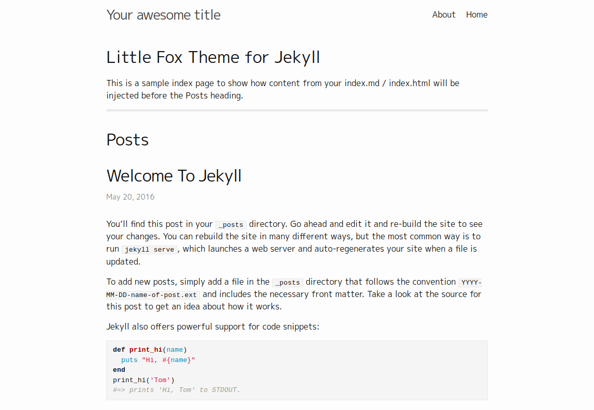

# Little Fox Theme for Jekyll

[Theme preview](https://kondratyev-nv.github.io/jekyll-theme-littlefox/)



## Usage with GitHub Pages

    remote_theme: kondratyev-nv/jekyll-theme-littlefox

For more information see [Use any theme with GitHub Pages](https://github.blog/2017-11-29-use-any-theme-with-github-pages/) and [GitHub Pages Documentation](https://help.github.com/en/articles/adding-a-jekyll-theme-to-your-github-pages-site).

## Customisation

Theme specific options are set from `littlefox` section in `_config.yml`.

```yml
littlefox:
  disable_header: true # Will remove the header and navigation bar 
```
